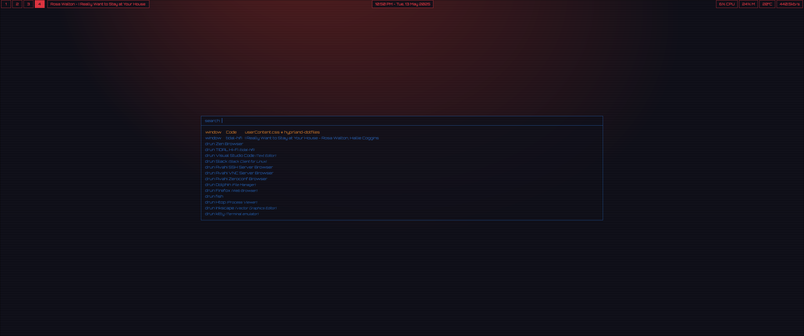
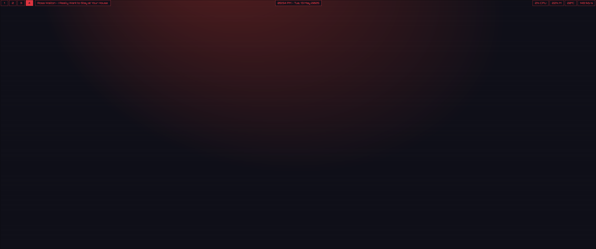
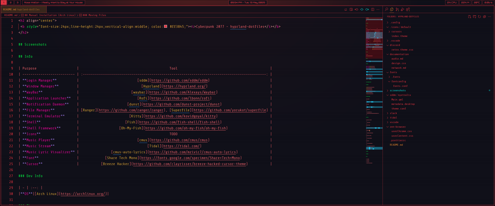
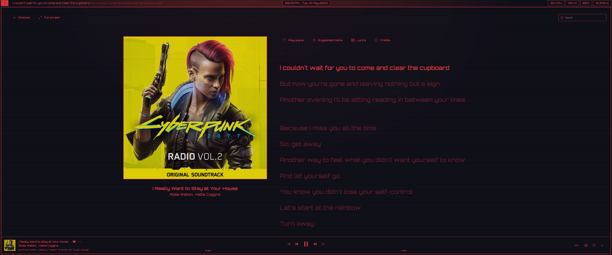
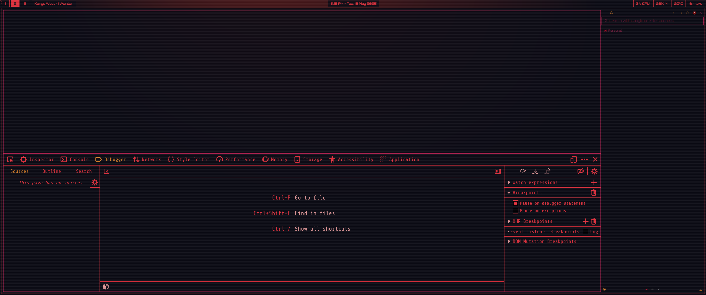
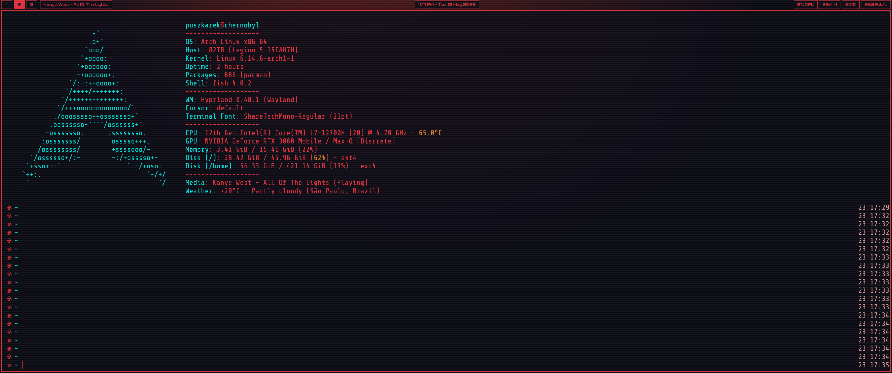
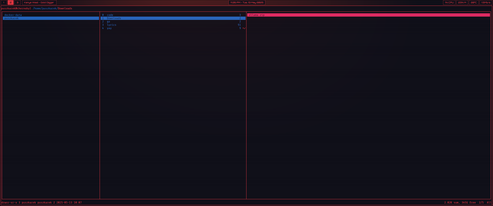

<h2 align="center">
 <b style="font-size:24px;line-height:24px;vertical-align:middle; color: #ff3845;"><i>Cyberpunk 2077 - hyprland-dotfiles</i></b>
</h2>



## Info

| Purpose                    |                                             Tool                                              |
| -------------------------- | :-------------------------------------------------------------------------------------------: |
| **Login Manager**          |                             [sddm](https://github.com/sddm/sddm)                              |
| **Window Manager**         |                               [Hyprland](https://hyprland.org/)                               |
| **WayBar**                 |                          [waybar](https://github.com/Alexays/Waybar)                          |
| **Application Launcher**   |                             [Rofi](https://github.com/lbonn/rofi)                             |
| **Notification Daemon**    |                        [dunst](https://github.com/dunst-project/dunst)                        |
| **File Manager**           | [Ranger](https://github.com/ranger/ranger), [Superfile](https://github.com/yorukot/superfile) |
| **Terminal Emulator**      |                         [Kitty](https://github.com/kovidgoyal/kitty)                          |
| **Shell**                  |                       [Fish](https://github.com/fish-shell/fish-shell)                        |
| **Shell Framework**        |                    [Oh-My-Fish](https://github.com/oh-my-fish/oh-my-fish)                     |
| **Icons**                  |                                             TODO                                              |
| **Music Player**           |                             [cmus](https://github.com/cmus/cmus)                              |
| **Music Stream**           |                                  [Tidal](https://tidal.com/)                                  |
| **Music Lyric Visualizer** |                [cmus-auto-lyrics](https://github.com/mzivic7/cmus-auto-lyrics)                |
| **Font**                   |             [Share Tech Mono](https://fonts.google.com/specimen/Share+Tech+Mono)              |
| **Cursor**                 |           [Breeze Hacker](https://github.com/clayrisser/breeze-hacked-cursor-theme)           |

### Themes

|**Visual Studio Code**|[Wiity Theme](https://marketplace.visualstudio.com/items/?itemName=puszkarek.wiity-vscode-theme)|

#### TUI Apps

|**Database Visualizer**|[harlequin](https://harlequin.sh/)|
|**MongoDB Visualizer**|[Vi Mongo](https://www.vi-mongo.com/)|
|**Postman Alternative**|[ATAC](https://github.com/Julien-cpsn/ATAC)|

## Keybinds

| Keybind         | Function                |
| --------------- | ----------------------- |
| `Super + Enter` | Launch terminal (kitty) |
| `Super + D`     | Launch Rofi             |
| `Super + Q`     | Close current window    |

## Manual Installation (Arch Linux)

### Dependencies

- [wl-clipboard](https://github.com/bugaevc/wl-clipboard)
- [grim](https://github.com/emersion/grim)
- [bard](https://github.com/Puszkarek/bard)
- [Rofi](https://github.com/davatorium/rofi/blob/next/INSTALL.md)
- [Kitty](ttps://github.com/kovidgoyal/kitty)
- [Fish](https://github.com/oh-my-fish/oh-my-fish)

#### Installing Dependencies

1. Install dependencies
   ```
   sudo pacman -S rofi kitty fish waybar fastfetch
   ```
1. Install utilities
   ```
   sudo pacman -S ranger lsd unzip hyprpaper wl-clipboard
   ```
1. Run post-install script
   ```
   curl -L https://get.oh-my.fish | fish
   curl https://raw.githubusercontent.com/oh-my-fish/oh-my-fish/master/bin/install | fish
   ```

### Moving Files

1. Copy `config` folder to `~/.config`
   ```
   cp -r .config/* ~/.config
   ```
1. Copy fonts to `~/.fonts`
   ```
   sudo cp -r fonts/.fonts/* /usr/share/fonts/ && cp -R fonts/fontconfig/* ~/.config/fontconfig/
   ```
1. Copy `zen-browser` files
   ```
   cp -r zen-browser/* ~/.zen/${PROFILE}/chrome/
   ```
1. Copy `icons` folder to `~/.icons`
   ```
   sudo cp -r .icons/* /usr/share/icons/
   ```
1. Copy `sddm` theme
   ```
   sudo cp -r sddm/* /usr/share/sddm/themes/
   ```
   - Go to the `/usr/lib/sddm/sddm.conf.d/default.conf` file
     - Add `Current=nyxtralis` under `[Theme]`
     - Add `Session=hyprland.desktop` under `[Autologin]`

### Screenshots









### References

### Inspiration

### TODOs

- [ ] Create icons theme
- [ ] Add gnome missing theme
- [ ] Create script to automate the install
